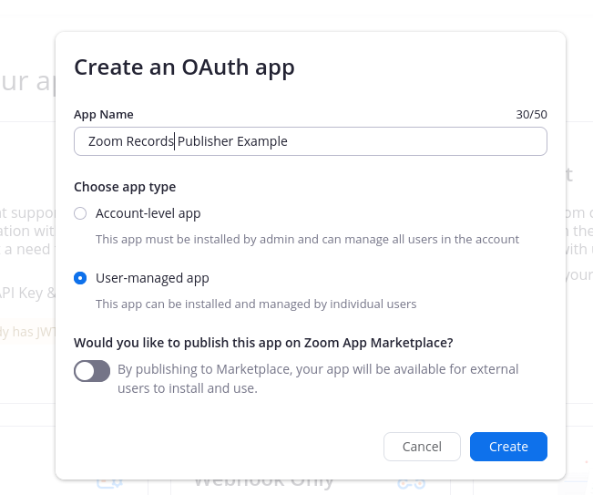
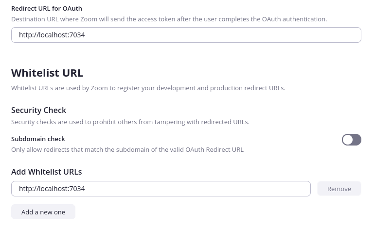
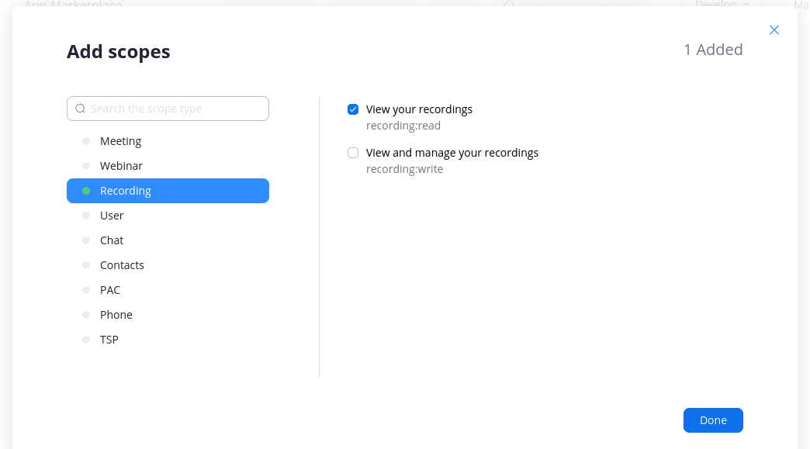
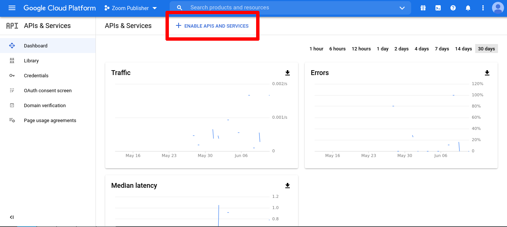
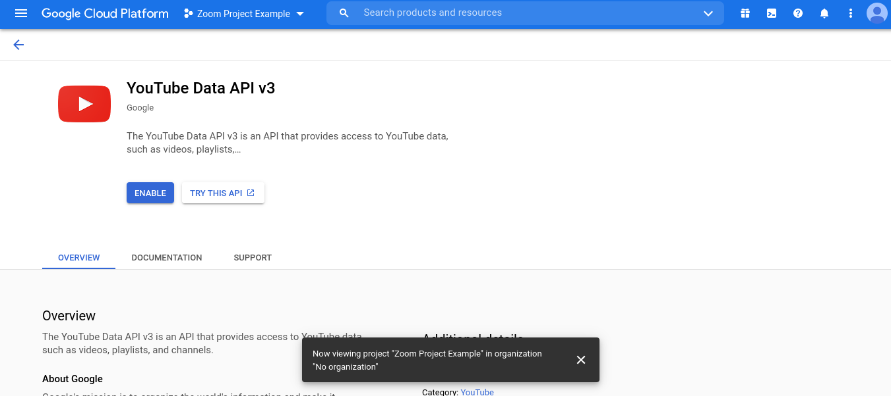
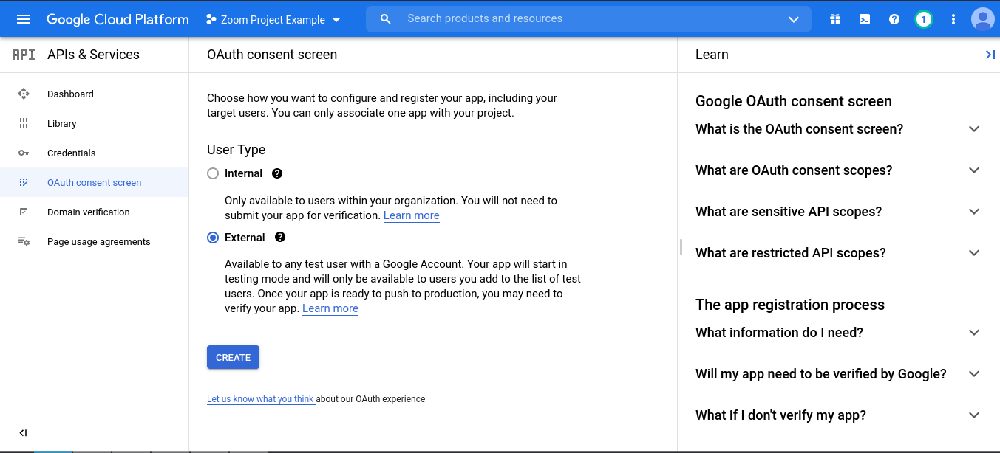
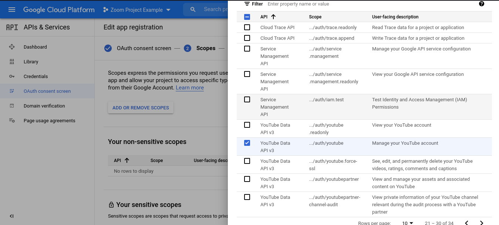
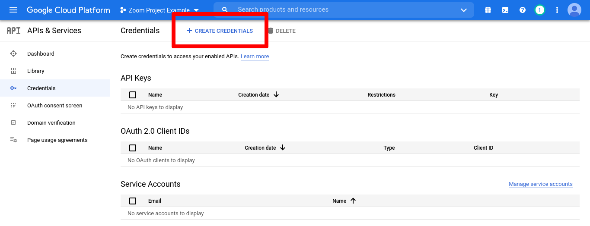

# Zoom Youtube Publisher

## Описание параметров в .env-файле
* MEETING_ID - id конференций через пробел
* PLAYLIST_ID - id плэйлиста, в которые нужно загрузить видео. Может быть пустым, если не нужно перемещать в плэйлист.
* PRIVACY_STATUS - у кого будет доступ к видео. public - доступно всем, private - ограниченный доступ, unlisted - доступ по ссылке
* SAVE_FILES - если false, то файлы будут удалены после публикации
* TOPIC_TEMPLATE - шаблон для названия видео
* DATE_TEMPLATE - шаблон, который будет добавлен, если конференция запускалась несколько раз
* INDEX_TEMPLATE - шаблон, который будет добавлен, если конференция имеет несколько записей
* ZOOM_CLIENT_ID - client id приложения, получаемый на https://marketplace.zoom.us/
* ZOOM_CLIENT_SECRET - client secret приложения, получаемый на https://marketplace.zoom.us/
* YOUTUBE_CLIENT_ID - client id приложения, получаемый на https://console.cloud.google.com/
* YOUTUBE_CLIENT_SECRET - client secret приложения, получаемый на https://console.cloud.google.com/

## Создание приложений
### Zoom

1. Зарегестрируйтесь на https://marketplace.zoom.us/
2. Создайте OAuth User-managed приложение на https://marketplace.zoom.us/develop/create

3. В "Redirect url" и "Whitelist url" добавьте localhost:7034

4. Введите информацию на вкладке "Information"
5. На вкладке "Scopes" добавьте recording:read

6. Скопируйте "Client ID" и "Client Secret" с вкладки "App Credentials" в .env файл

Официальная инструкция: https://marketplace.zoom.us/docs/guides/build/oauth-app

### Youtube

1. Создайте новый проект на https://console.cloud.google.com/

2. Перейдите на вкладку "APIs & Services" и добавьте новое API

3. Вернитесь на вкладку "APIs & Services" и перейдите на вкладку "OAuth consent screen"

4. Нажмите на "Create". На вкладке "OAuth consent screen" введите всю необходимую информацию
5. На вкладке "Scopes" добавьте "../auth/youtube"

6. На вкладке "Test users" добавьте пользователей, которые будут иметь доступ к приложению

7. После того, как завершите создание страницы, перейдите на вкладку "Credentials" и создайте новые Oauth реквизиты

8. В "Application type" выберите "Descktop App"
9. Скопируйте "CLient ID" и "Client Secret" в .env файл

Официальная инструкция: https://developers.google.com/youtube/v3/getting-started?hl=ru

## Сборка и запуск docker-контейнера

1. Запустите файл build.sh
2. Запустите файл run.sh
